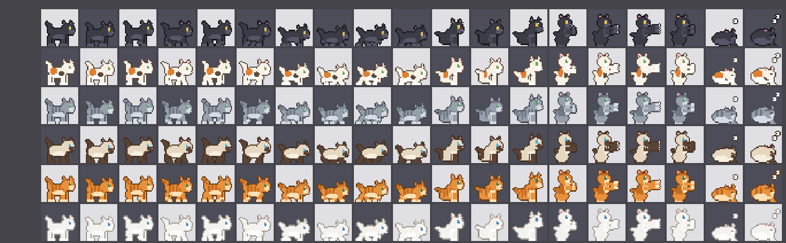

# Ubuntu Cats

A colony of pixel-art cats that live on your Ubuntu dock. They chase the mouse
pointer, sit and stare up at it, nap when you ignore them, and periodically
claw at your app icons — which visibly shake when they do.

Built as a GNOME Shell extension, because that is the only way to get at where
the dock icons actually are. A standalone app would get an always-on-top window
and nothing else.



## Prerequisites

### To run it

| Need | Why | Ubuntu 24.04 |
|---|---|---|
| GNOME Shell 45–48 | The extension targets this API | preinstalled |
| A dock | Ubuntu Dock, Dash to Dock, Dash to Panel, or the stock GNOME dash | Ubuntu Dock is preinstalled |
| `gnome-extensions` | Enabling and configuring | ships with `gnome-shell` |
| `glib-compile-schemas` | Compiles the settings schema at install time | `sudo apt install libglib2.0-bin` |

### To build it from source

| Need | Why | Ubuntu 24.04 |
|---|---|---|
| Node **22.18+** (24 recommended) | Compiles TypeScript, and runs the build tool | see below |
| `git` | Cloning | `sudo apt install git` |

Node 22.18 is the floor because `tools/cli.ts` is TypeScript executed directly
by Node, which needs type stripping enabled by default. Ubuntu 24.04's own
`nodejs` package is 18, which is too old — use
[nvm](https://github.com/nvm-sh/nvm) or [NodeSource](https://github.com/nodesource/distributions).

Python 3 is **not** needed to install: the sprites are generated ahead of time
and committed. You only need it to regenerate the art (`npm run sprites`).

### Optional, for the test harness

`sudo apt install dbus-daemon gstreamer1.0-tools` — `npm run test:shell` needs
`dbus-run-session`, and its screenshot helper needs `gst-launch-1.0`.

### Check what you have

```bash
gnome-shell --version
node --version
echo "session: $XDG_SESSION_TYPE"
command -v glib-compile-schemas gnome-extensions
```

## Install and run

### Option A — from source

```bash
git clone https://github.com/PatrikSchweika/ubuntu-cats.git
cd ubuntu-cats
npm install
npm run ext:install
```

Then **restart GNOME Shell, and only then enable it.** The order matters:
`gnome-extensions enable` asks the *running* shell to enable the extension, and
the shell only scans the extensions directory when it starts. Enabling before a
restart fails with `Extension "ubuntu-cats" does not exist`.

1. Restart the shell:
   - **X11**: <kbd>Alt</kbd>+<kbd>F2</kbd>, type `r`, <kbd>Enter</kbd>
   - **Wayland**: log out and back in — the shell cannot restart in place

2. Enable it. This takes effect immediately, with no second restart:

   ```bash
   npm run ext:enable
   ```

Cats should appear along the bottom edge of your screen. Move the pointer near
the dock and they will come to it. To change how many there are, how fast they
run, or whether they scratch, open the settings:

```bash
gnome-extensions prefs ubuntu-cats
```

See [Opening them](#opening-them) for the graphical route — Ubuntu does not
install an Extensions app by default.

`ext:enable` checks first whether the running shell has actually scanned the
extension, and tells you to restart instead of failing with GNOME's confusing
"does not exist" — which is what you get when the extension is plainly
installed but the shell started before it was.

### Option B — from a packaged zip (no Node needed)

Useful for installing on a machine you do not want a toolchain on. Build the
zip once somewhere with Node:

```bash
npm run ext:pack        # writes dist/ubuntu-cats.shell-extension.zip
```

then on the target machine:

```bash
gnome-extensions install --force ubuntu-cats.shell-extension.zip
```

Restart the shell as above, then `gnome-extensions enable ubuntu-cats`.

### Everyday commands

```bash
npm run ext:prefs        # open the settings dialog
npm run ext:disable      # stop the cats, keep it installed
npm run ext:enable       # start them again
npm run ext:uninstall    # disable and remove entirely
npm run logs             # follow gnome-shell's log
```

Without the repo checked out, the same things are
`gnome-extensions prefs|disable|enable ubuntu-cats`. See
[Opening them](#opening-them) for the graphical route.

### Updating

```bash
git pull
npm install
npm run ext:install
```

Then restart the shell. GNOME caches ES modules, so a running shell keeps the
old code until it restarts — no need to disable and re-enable.

### If something goes wrong

| Symptom | Cause |
|---|---|
| `Extension "ubuntu-cats" does not exist` | The shell has not scanned it yet — restart the shell, then enable |
| Enabled, but no cats | No dock found. Confirm a dock extension is enabled, and check `npm run logs` |
| Cats appear then vanish | Expected: they hide with the dock when intellihide or the overview takes it away |
| `glib-compile-schemas: not found` | `sudo apt install libglib2.0-bin` |
| `SyntaxError` running `npm run ext:install` | Node older than 22.18 — see prerequisites |

### A note on the UUID

The extension's UUID is a bare `ubuntu-cats`. GNOME's convention is
`name@domain` and **extensions.gnome.org requires that form**, so publishing
there would mean changing it. The shell itself only requires that the UUID
match the installed directory name, which a bare name satisfies — verified
loading cleanly on GNOME 46.

The GSettings schema is `org.gnome.shell.extensions.ubuntu-cats` and is
independent of the UUID, so renaming the extension does not lose your settings.

## Settings

### Opening them

From a terminal — this always works, because `gnome-extensions` ships with
GNOME Shell itself:

```bash
gnome-extensions prefs ubuntu-cats
```

Or, from a checkout of this repo, `npm run ext:prefs`.

**Ubuntu has no graphical Extensions app installed by default.** GNOME ships an
`org.gnome.Shell.Extensions.desktop` entry, but on Ubuntu 24.04 it is a hidden
stub (`Exec=false`, `NoDisplay=true`) and there is no app behind it. To get a
GUI, install one:

```bash
sudo apt install gnome-shell-extension-prefs   # GNOME's own "Extensions" app
# or
sudo apt install gnome-shell-extension-manager # "Extension Manager", third-party
```

Then launch **Extensions** (or **Extension Manager**) from the app grid, find
*Ubuntu Cats*, and click the gear icon beside it.

Either way the extension has to be one the running shell knows about, so if the
settings command reports that it does not exist, restart the shell first — see
[Install and run](#install-and-run).

Every setting applies immediately; none of them need a restart.

| Setting | Default | What it does |
|---|---|---|
| Cats | 3 | How many live on the dock (1–8) |
| Cat size | 0 | Pixels; 0 matches the dock's own icon size |
| Fur palettes | all | tabby-orange, grey-tabby, black, white, siamese, calico |
| Mouse attraction | 60 | How hard they chase the pointer; 0 ignores it |
| Attraction radius | 260 | How far above the screen's bottom edge the pointer still interests them |
| Top speed | 220 | Pixels per second at a full run |
| Nap after | 20 | Seconds of stillness before they curl up; 0 keeps them awake |
| Scratch app icons | on | Cats stop at an icon and claw at it |
| Shake the scratched icon | on | Rocks the **real** dock icon — turn off to leave the dock untouched |
| Animation frame rate | 12 | Sprite frames per second |

## Scripts

| Command | What it does |
|---|---|
| `npm run check` | The full gate: Biome, typecheck, schema/metadata/sprite validation, and the test suite |
| `npm test` | Unit tests (`node --test`) |
| `npm run test:watch` | …the same, re-run on change |
| `npm run fix` | Apply Biome's fixes and formatting |
| `npm run lint` / `npm run format` | Lint only / format-write only |
| `npm run typecheck` | `tsc --noEmit` over `src/`, and again over `tools/` |
| `npm run build` | Compile `src/*.ts` → `build/`, copying assets, schemas and metadata alongside |
| `npm run ext:install` | Build, then install into `~/.local/share/gnome-shell/extensions/` |
| `npm run ext:enable` / `ext:disable` / `ext:prefs` | Extension lifecycle |
| `npm run ext:pack` | Distributable zip in `dist/` |
| `npm run ext:uninstall` | Disable and remove |
| `npm run sprites` | Regenerate the sprite frames |
| `npm run test:shell` | Headless GNOME Shell for testing — cannot touch your desktop |
| `npm run dev` | Nested shell in a window |
| `npm run logs` | `journalctl` follow on gnome-shell |

Scripts are prefixed `ext:` so none collide with npm's own commands — in
particular, a script named `install` would run on every `npm install`.

## Tests

```bash
npm test
```

84 tests, no dependencies beyond Node — `node:test` runs the TypeScript
directly, the same way `tools/cli.ts` does.

**How they run at all.** The extension imports `gi://St`,
`resource:///org/gnome/shell/...` and GJS globals, none of which exist in Node.
`tests/support/hooks.ts` registers in-thread `module.registerHooks` that point
those specifiers at stubs in `tests/support/stubs/`, installs `global`, `log`
and `logError`, and maps the `.js` import specifiers in `src/` onto the `.ts`
files on disk. Production code is imported unmodified — nothing is refactored
for testability.

The stubs are controllable rather than inert: `St` has a settable scale factor
so HiDPI is testable, `GLib` collects timeout sources so the tick can be driven
by hand instead of by real time, and `Gio.Settings` can fire `changed` so live
setting updates can be exercised.

What is covered:

| Area | What is checked |
|---|---|
| `cat.ts` | Placement on the floor, roaming bounds and the icon bias, pointer chasing and fan-out, sleeping and waking, sitting, scratching and its cooldown, gaits, facing, frame advance, and the HiDPI unit handling |
| `dockTracker.ts` | Dash discovery, ignoring the overview's dash, measuring the painted background, logical vs stage icon sizes, and degrading to empty rather than throwing when the dock's internals move |
| `iconWiggle.ts` | Bounded rotation, exact restoration of rotation and pivot, no leaked destroy handlers, and surviving an actor that throws |
| `extension.ts` | Enable/disable lifecycle, live setting changes, one tick source across interval changes, drowsy throttling, and that disable restores every icon and disconnects every signal |
| `sprites.ts` | Manifest loading, frame paths, fallbacks, palette resolution |
| Generated art | Every frame present, on a 32×32 grid, clear of the left/right/top edges, and with feet on the bottom row |

Several tests are labelled *Regression*; each pins a bug that shipped. The suite
was checked against deliberately reintroduced versions of those bugs — reverting
the HiDPI fix, re-rooting `ALERT`, making `SIT` permanent, dropping the icon
restore, leaking a destroy handler — and each one fails the suite. That matters
more than the count: two tests originally passed against a reintroduced bug and
had to be rewritten.

### Type-checking

Three `tsc` programs, because three sets of ambient types apply:

| Config | Covers | Types |
|---|---|---|
| `tsconfig.json` | `src/` — and emits `build/` | GNOME (`@girs`) |
| `tsconfig.tools.json` | `tools/` | Node |
| `tsconfig.tests.json` | `tests/`, and `src/` transitively | GNOME **and** Node |

The third one needs a trick. `@girs/gnome-shell/extensions/global` declares
`const global: Shell.Global`, which collides with `@types/node`'s
`var global: typeof globalThis` — and the tests need Node's types for
`node:test`. So that program leaves the girs global out and
`tests/support/gjs-globals.d.ts` declares the handful of things `src/` actually
uses off the global scope (`stage`, `get_pointer`, `log`, `logError`) as `var`
and `function`. Declared that way they land on `globalThis`, so `global.stage`
resolves through Node's declaration and both type universes coexist.

The stubs still cannot *implement* GObject types — `Clutter.Actor` declares some
400 members — so substituting a stub for a real actor is a cast. Every one goes
through the two named helpers in `tests/support/cast.ts`, which keeps the
boundary greppable rather than scattered.

## Linting and formatting

Biome runs with its **stock recommended configuration** — tabs, double quotes,
recommended rules, nothing disabled. `biome.json` deviates from `biome init` in
exactly one way:

```json
"includes": ["**", "!!**/dist", "!src/assets/**"]
```

`src/assets/**` is excluded because `manifest.json` in there is generated by
`tools/gen_sprites.py`. Without the exclusion Biome reformats it and the very
next `npm run sprites` writes it back out unformatted, so `npm run check` would
pass or fail depending on which ran last. `build/`, `dist/` and `node_modules/`
need no entry — Biome picks them up from `.gitignore` via `vcs.useIgnoreFile`.

`noNonNullAssertion` originally flagged 15 sites, all caused by the
enabled-only state living in six separate nullable fields. Those are now
grouped into one `Runtime` object that each method narrows once, so the
assertions are gone rather than suppressed.

## How it works

**Finding the dock.** Nothing is imported from the dock extension — importing
`ubuntu-dock`'s `docking.js` would create a second module instance whose
`DockManager` singleton is null. Instead `lib/dockTracker.ts` duck-types the
actor tree: it looks for a descendant named `dash`, then for icon containers
whose `.child` exposes `.icon`. That is the same predicate dash-to-dock's own
`getAppIcons()` uses, and it works for the stock dash and Dash to Panel too.
Because those internals are not public API, they are modelled as narrow
`…Like` interfaces in that one file, and every access is optional and guarded.

**Where they walk.** Cats walk along the bottom edge of the monitor the dock is
on, and roam its full width — they are free to leave the dock entirely. What
keeps them around the icons is a bias, not a fence: a wander target is an
actual dock icon 70% of the time and anywhere on the floor otherwise, so they
congregate at the dock but do go for the occasional stroll. The floor is the
*monitor's* bottom edge rather than the dock's: a floating dock
(`extend-height=false`) stops short of the screen edge, and standing them on
its underside leaves them hovering just above the floor.

**HiDPI.** Two coordinate spaces are in play and mixing them is the easiest way
to break this: St sizes things in *logical* pixels (`icon_size`), while Clutter
positions and `get_transformed_size()` are in *stage* pixels. They differ by the
scale factor, so at 2x an `icon_size` of 64 allocates 128 stage px. Cats
therefore carry both — `iconSize` for St and `size` (from St's own preferred
height) for every position — and the auto-size reads the dock icon's
`icon_size` rather than its measured height. The pixel-valued settings
(attraction radius, top speed) are logical too, so they are scaled to stage
pixels before use; otherwise they would mean half as much on a 2x display.

**Following the dock.** Every tick reads *transformed* (stage-space) positions
fresh rather than caching geometry. Intellihide, auto-hide, icon-size changes
and monitor changes therefore need no special handling — the dock moves and the
cats move with it. Cats also resize live when the dock's icon size changes.

**Not stealing your clicks.** The overlay is added with `Main.uiGroup.add_child()`,
not `addChrome()`, so it affects neither struts nor input regions, and both the
layer and every cat are `reactive: false`. Clicks pass straight through a cat to
the icon underneath.

**Touching your dock.** Shaking a real icon is the only thing that reaches into
another extension's actors, so it is confined to `lib/iconWiggle.ts`. It drives
`rotation_angle_z` directly from our own tick instead of installing a Clutter
transition (nothing to cancel, nothing to collide with the dock's hover-zoom),
targets the inner icon rather than the button, records every actor's original
rotation and pivot, drops references when an actor is destroyed, and restores
everything in `disable()`.

**Staying cheap.** The tick runs at 30Hz while something is happening and drops
to 4Hz once every cat is asleep or the dock is hidden.

## TypeScript notes

Types for the GNOME APIs come from [`@girs/gnome-shell`](https://github.com/gjsify/gnome-shell),
pinned to `46.x` to match the target shell — the major version tracks the GNOME
release, so a mismatch would type-check against APIs your shell does not have.

`package.json` pins `@girs/glib-2.0`, `@girs/gobject-2.0` and `@girs/gio-2.0`
through `overrides`. The `@girs` dependency tree otherwise pulls in dozens of
copies of the core GLib stack at differing versions, and TypeScript treats
`Gio.Icon` from two copies as two unrelated nominal types. Removing those
overrides brings back errors like *"Property `$signals` is missing in type
`Icon` but required in type `Icon`"*.

`Runtime` in `extension.ts` holds everything that exists only while the
extension is enabled. Grouping it means each method narrows once at the top and
then works with non-null values, and `disable()` releases the whole graph by
clearing a single reference.

Build tooling (`tools/cli.ts`) is TypeScript too, run directly by Node's native
type stripping, so it needs no build step of its own.

## Sprites

The art is generated, not hand-drawn, by `tools/gen_sprites.py` (standard
library only — it writes SVG directly). Anatomy is code, poses are data, so
tweaking the cats means editing numbers in `POSES` rather than 114 files.

```bash
npm run sprites
```

Output is committed, so installing needs no Python. The generator refuses to
emit a frame whose art touches the frame border, which is what keeps tails from
being clipped.

## Development

GNOME 45+ caches ES modules, so **every change needs a full shell restart** —
`gnome-extensions disable && enable` will not pick it up.

Two ways to iterate without logging out:

```bash
npm run test:shell   # headless shell, own D-Bus + own dconf, invisible
npm run dev          # nested shell in a window
```

`test:shell` is the safer of the two: it runs `gnome-shell --headless
--virtual-monitor` against a throwaway config, so it cannot disturb your
session. Capture what it is showing with:

```bash
tools/test-shell.sh shot 3 out    # writes out000.png
```

## Verifying a change

`npm run check` covers the static half. The rest only a running shell can tell
you, and is worth re-checking after touching the dock-facing code:

1. Cats run toward the pointer, slow to a walk, and stop under it
2. Pointer held above the dock → cats sit and look up
3. Left alone → cats curl up and the tick drops to 4Hz
4. A cat stops at an icon, claws it, and **that icon shakes**
5. Maximize a window so intellihide fires → dock and cats leave together
   (the cats stand on the screen floor, so they wink out rather than sliding
   away with the dock)
6. Open the overview → cats vanish, and come back on close
7. Click a dock icon *through* a cat → the app launches
8. Change the cat count in prefs → applied live, no restart
9. `npm run ext:disable` → **every icon rotation back to 0**, no leftover timeouts
10. Nothing from the extension in `npm run logs` throughout

Number 9 is the one that matters: it is what keeps a bug here from outliving the
extension and leaving your dock crooked.

## Licence

MIT.
